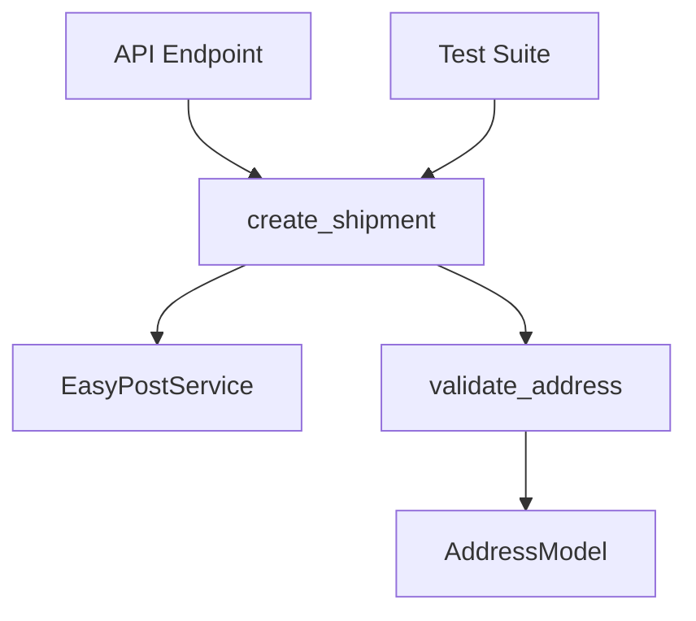

Explain selected code using AI reasoning chain with MCP tools, architecture mapping, and performance analysis.

**Context-aware**: No arguments needed - automatically uses selected code in editor or current open file. Provides comprehensive explanation with architecture context, call graphs, and optimization suggestions.

## How It Works

**Complete MCP Workflow (5 Stages):**

**Stage 1 - Sequential-thinking Analysis** (ENHANCED):
- Breaks down code logic step-by-step (10-15 thoughts)
- Identifies what each section does
- Traces data flow and dependencies
- Notes potential issues or optimizations

**Stage 2 - Framework Context** (ENHANCED):
- Detects framework from imports
- Fetches official documentation via Context7
- Gets best practices and patterns
- Provides real-world examples

**Stage 3 - Architecture Mapping** (NEW):
- Finds all usages in codebase
- Maps call graph and dependencies
- Shows data flow
- Generates architecture diagram

**Stage 4 - Performance Analysis** (NEW):
- Identifies bottlenecks
- Calculates complexity (Big O)
- Suggests M3 Max optimizations
- Compares with alternatives

**Stage 5 - Generate Report** (ENHANCED):
- Combines all analysis
- Provides actionable recommendations
- Links related code
- Suggests improvements

## What You Get

**Comprehensive Explanation:**
1. **What it does** (plain English)
2. **How it works** (step-by-step with Sequential-thinking)
3. **Why it's designed this way** (architectural context)
4. **Where it's used** (call graph and dependencies)
5. **Performance implications** (M3 Max optimization opportunities)
6. **Related code** (dependencies, callers)
7. **Best practices comparison** (Context7 framework docs)
8. **Improvement suggestions** (actionable recommendations)

## MCP Integration

### Stage 1 - Sequential Thinking

```yaml
Tool: mcp_sequential-thinking_sequentialthinking
Input: Selected code or file content
Thoughts: 10-15 steps
Analyzes:
  - Logic flow
  - Edge cases
  - Assumptions
  - Data transformations
  - Error handling
  - Return values

Progress: await ctx.report_progress(0, 5, "Analyzing code logic")
State: ctx.set_state("analysis", {
  "steps": [list of thought steps],
  "key_insights": [list of insights],
  "potential_issues": [list of issues]
})

Output: Step-by-step breakdown
Logging: await ctx.info("Completed Sequential-thinking analysis")
```

### Stage 2 - Framework Context

```yaml
Tool: mcp_Context7_resolve-library-id
Query: Auto-detect framework from imports
Examples:
  "fastapi" → /tiangolo/fastapi
  "react" → /facebook/react
  "gin" → /gin-gonic/gin
  "tokio" → /tokio-rs/tokio

Detection patterns:
  Python: "from fastapi import" → FastAPI
  Python: "from django.http import" → Django
  JS: "const express = require" → Express
  JS: "import { useEffect } from" → React
  Go: 'import "github.com/gin-gonic/gin"' → Gin
  Rust: "use tokio::" → Tokio

Tool: mcp_Context7_get-library-docs
Library: Resolved ID from previous step
Topic: Auto-generated from code context
  Examples:
    "async patterns best practices"
    "component lifecycle hooks"
    "error handling patterns"
    "performance optimization"
Tokens: 3000-5000

Progress: await ctx.report_progress(1, 5, "Loading framework documentation")
State: ctx.set_state("framework_docs", docs_content)

Error handling:
  from fastmcp.exceptions import ToolError
  try:
    docs = await context7_call()
  except ToolError as e:
    await ctx.warning(f"Context7 unavailable: {e}")
    ctx.set_state("framework_docs", None)

Cache: 24h for framework docs
Logging: await ctx.info(f"Loaded docs for {framework}")
```

### Stage 3 - Architecture Mapping

```yaml
Tool: mcp_desktop-commander_start_search
Pattern: Function/class name from code
SearchType: "content"
Find: All usages in codebase
ContextLines: 3

Example searches:
  Function: "create_shipment" → Find all calls
  Class: "EasyPostService" → Find all instantiations
  Method: "get_rates" → Find all invocations

Tool: mcp_sequential-thinking_sequentialthinking
Input: Search results + code structure
Thoughts: 6-8
Map:
  - Call graph (who calls this code)
  - Dependencies (what this code depends on)
  - Data flow (how data moves through)
  - Impact scope (what breaks if this changes)

Progress: await ctx.report_progress(2, 5, "Mapping architecture")
State: ctx.set_state("architecture", {
  "callers": [list of files/functions that call this],
  "dependencies": [list of dependencies],
  "data_flow": description,
  "impact_scope": description
})

Output: Architecture diagram (mermaid syntax)
Logging: await ctx.info(f"Found {len(callers)} callers, {len(dependencies)} dependencies")

Example mermaid output:

```

### Stage 4 - Performance Analysis

```yaml
Tool: mcp_sequential-thinking_sequentialthinking
Input: Code + architecture context
Thoughts: 8-10
Analyze:
  - Time complexity (Big O notation)
  - Space complexity
  - Bottlenecks (loops, I/O, database queries)
  - Optimization opportunities
  - M3 Max specific optimizations (16 cores, 128GB RAM)

Consider:
  - Database queries (N+1 problems, missing indexes)
  - Loops (O(n²) patterns, unnecessary iterations)
  - API calls (blocking vs async, rate limits)
  - Memory usage (large objects, caching opportunities)
  - CPU usage (parallelization opportunities)

Progress: await ctx.report_progress(3, 5, "Analyzing performance")
State: ctx.set_state("performance", {
  "time_complexity": "O(n)",
  "space_complexity": "O(1)",
  "bottlenecks": [list of bottlenecks],
  "optimization_opportunities": [list of optimizations],
  "m3_max_suggestions": [list of M3 Max specific optimizations]
})

Logging:
  await ctx.info(f"Complexity: {time_complexity}")
  await ctx.warning(f"Found {len(bottlenecks)} bottlenecks")
```

### Stage 5 - Generate Report

```yaml
Combine all analysis into comprehensive report:
  - Sequential-thinking breakdown
  - Framework best practices
  - Architecture diagram
  - Performance analysis
  - Actionable recommendations

Progress: await ctx.report_progress(4, 5, "Generating report")
Output: Structured markdown report

Logging: await ctx.info("Report generated successfully")
```

## Auto-Detection

**Detects framework from code:**
```python
from fastapi import FastAPI    # → FastAPI
from django.http import        # → Django
const express = require        # → Express
import { useEffect } from      # → React
import "github.com/gin-gonic/gin"  # → Gin
use tokio::                    # → Tokio
```

**Context7 libraries:**
- FastAPI: `/tiangolo/fastapi`
- React: `/facebook/react`
- Django: `/django/django`
- Vue: `/vuejs/vue`
- Express: `/expressjs/express`
- Gin: `/gin-gonic/gin`
- Tokio: `/tokio-rs/tokio`

## Example Outputs

### Example 1: Explaining Backend Function

```bash
# Select this code in easypost_service.py:
async def create_shipment(self, to_address, from_address, parcel, carrier):
    try:
        loop = asyncio.get_running_loop()
        result = await loop.run_in_executor(
            self.executor, self._create_shipment_sync, ...
        )
        return result
    except Exception as e:
        ...

# Run: /explain
```

**Output:**
```
🧠 Sequential-thinking Analysis (12 steps):

Step 1: Function creates shipping label via EasyPost API
Step 2: Uses async/await for non-blocking execution
Step 3: Offloads blocking I/O to ThreadPoolExecutor
Step 4: executor has auto-detected workers (max 16)
Step 5: Calls synchronous _create_shipment_sync in thread
Step 6: await prevents blocking event loop
Step 7: Error handling catches all exceptions
Step 8: Returns standardized ShipmentResponse

Key insight: Hybrid async pattern - async wrapper around sync I/O

📚 Context7 - FastAPI Best Practices:
- Pattern: "Async wrapper + ThreadPoolExecutor" is recommended
- Use case: Wrapping synchronous SDK clients
- Performance: Allows concurrent request handling
- Alternative: Use httpx.AsyncClient if API supports

🏗️ Architecture Mapping:
Callers:
  - backend/src/routers/shipments.py:110 (API endpoint)
  - backend/tests/unit/test_service.py:42 (test)

Dependencies:
  - easypost SDK (external)
  - ThreadPoolExecutor (concurrency)
  - ShipmentResponse model

Data Flow:
  1. API endpoint receives request
  2. Calls create_shipment()
  3. Executor runs sync SDK call
  4. Returns ShipmentResponse
  5. Endpoint serializes to JSON

Call Graph:
```
POST /api/shipments
    ↓
create_shipment() [this function]
    ↓
ThreadPoolExecutor
    ↓
_create_shipment_sync()
    ↓
EasyPost API
```

⚡ Performance Analysis (M3 Max):
Time Complexity: O(1) - Single API call
Space Complexity: O(1) - Constant memory

Bottlenecks:
- EasyPost API latency (external dependency)
- ThreadPoolExecutor overhead (minimal)

Optimization Opportunities:
- Current: Auto-detected workers (max 16) = optimal for 16 cores
- Throughput: 16 concurrent API calls
- Bottleneck: EasyPost API rate limits, not CPU
- Optimization: Already well-optimized for M3 Max

M3 Max Specific:
- 16 workers matches 16 CPU cores perfectly
- No memory constraints (128GB available)
- Consider connection pooling for API calls

💡 Suggestions:
1. Add timeout to run_in_executor (prevent hanging)
2. Consider circuit breaker for API failures
3. Add retry logic with exponential backoff
4. Cache results for identical requests
5. Monitor API rate limits

🎯 Summary:
Well-designed async pattern that efficiently uses M3 Max's 16 cores
for parallel API calls. Main optimization opportunity is adding
resilience (retry, timeout, circuit breaker) rather than performance.
```

### Example 2: Explaining Frontend Component

```jsx
// Select in TrackingPage.jsx:
const [loading, setLoading] = useState(true);

useEffect(() => {
  const fetchDashboardData = async () => {
    const [statsResponse, recentResponse] = await Promise.all([
      shipmentAPI.getStats(),
      shipmentAPI.getRecentShipments(5),
    ]);
    setStats(statsResponse.data);
  };
  fetchDashboardData();
}, []);
```

**Output:**
```
🧠 Sequential-thinking Analysis (8 steps):

Step 1: Component fetches data on mount via useEffect
Step 2: Promise.all runs two API calls in parallel
Step 3: Destructures responses into variables
Step 4: Updates state with setStats()
Step 5: Empty dependency array [] = runs once on mount
Step 6: Loading state manages UI during fetch
Step 7: Missing error handling (no try/catch)
Step 8: Missing cleanup (could cancel on unmount)

Key insight: Parallel data fetching for better performance, but missing error handling

📚 Context7 - React Best Practices:
- Pattern: "Parallel fetching with Promise.all"
- Recommended: Use React Query for caching
- Better: Extract to custom hook for reusability
- Example: useQuery() with staleTime for automatic caching

🏗️ Architecture Mapping:
Callers:
  - App.jsx (routing)
  - Navigation component (links to this page)

Dependencies:
  - shipmentAPI service
  - React hooks (useState, useEffect)
  - Dashboard component (renders stats)

Data Flow:
  1. Component mounts
  2. useEffect triggers
  3. Parallel API calls
  4. State updates
  5. Component re-renders with data

Call Graph:
```
App Router
    ↓
TrackingPage [this component]
    ↓
useEffect hook
    ↓
Promise.all([
    shipmentAPI.getStats(),
    shipmentAPI.getRecentShipments()
])
    ↓
setStats() → Re-render
```

⚡ Performance Analysis:
Time Complexity: O(1) - Two parallel API calls
Space Complexity: O(1) - Constant memory

Bottlenecks:
- API response time (external dependency)
- No request deduplication (both calls could cache)

Optimization Opportunities:
- Parallel fetching: Good! Reduces load time 2x
- Missing: Request deduplication (both calls could cache)
- Missing: Error boundaries for failed fetches
- M3 Max: Browser can handle many parallel requests

M3 Max Specific:
- Browser can handle 6+ parallel requests easily
- Consider prefetching related data
- Use service workers for offline caching

💡 Suggestions:
1. Use React Query for automatic caching and retry
2. Extract to custom hook: useDashboardData()
3. Add error state handling
4. Add loading skeleton component
5. Consider SWR or TanStack Query
6. Add cleanup to cancel requests on unmount

Example with React Query:
const { data: stats } = useQuery({
  queryKey: ['stats'],
  queryFn: shipmentAPI.getStats,
  staleTime: 30000
});
```

## Usage Examples

```bash
# Explain selected code (most common)
# 1. Select code in editor
# 2. Run:
/explain

# Explain entire open file
/explain

# Explain specific file
/explain backend/src/services/easypost_service.py

# Explain with focus
/explain --focus=performance
/explain --focus=security
/explain --focus=architecture
```

## Performance

- Sequential-thinking: 5-8s (10-15 thoughts)
- Context7 lookup: 2-4s (cached 24h)
- Architecture mapping: 2-3s (search + analysis)
- Performance analysis: 2-3s (Sequential-thinking)
- Report generation: 1-2s
- **Total: 12-20s** for comprehensive explanation

## Desktop Commander Tools Used

**Primary Tools:**
- `mcp_desktop-commander_start_search` - Find code usages
- `mcp_desktop-commander_read_file` - Read related files
- `mcp_sequential-thinking_sequentialthinking` - Code analysis, architecture mapping, performance analysis
- `mcp_Context7_resolve-library-id` - Framework detection
- `mcp_Context7_get-library-docs` - Best practices

## Error Handling

**Framework Detection Failure:**
- Continue without framework-specific docs
- Use generic analysis patterns
- Report warning

**Context7 Unavailability:**
- Continue with Sequential-thinking analysis only
- Report warning about missing framework docs
- Provide generic best practices

**Search Failures:**
- Continue without architecture mapping
- Report warning about incomplete call graph
- Provide analysis based on code only

## Adapts To Any Language

Uses `.dev-config.json` to provide context:
- Language conventions
- Framework patterns
- Project architecture
- Performance targets (M3 Max specs)

**One command. Deep understanding. Any code. Complete context.**
